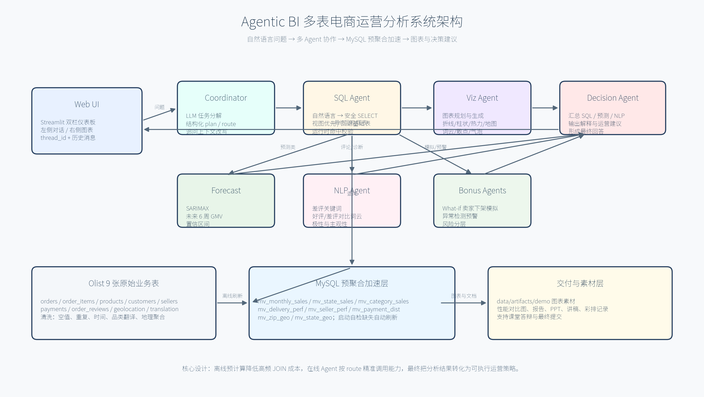
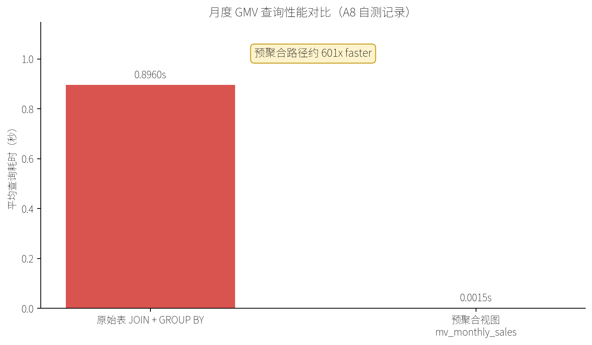
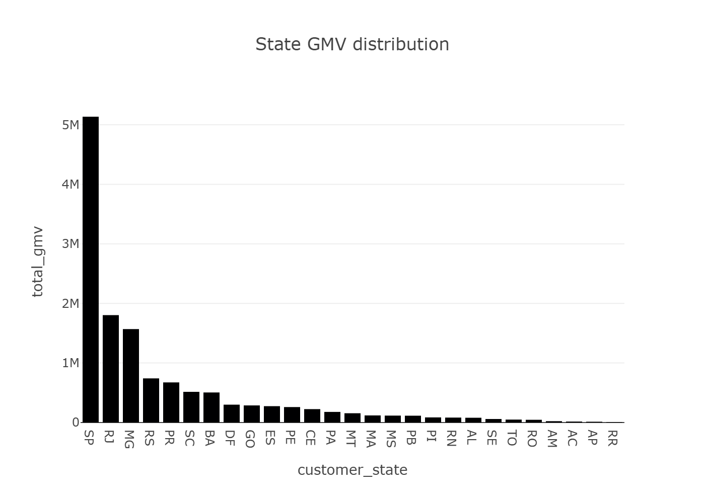
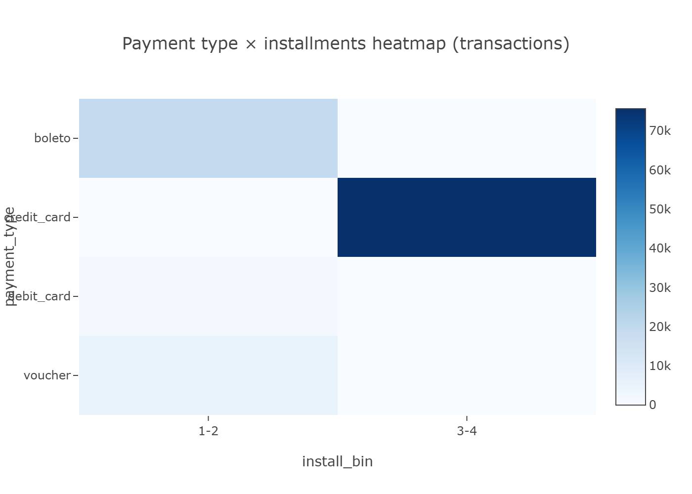
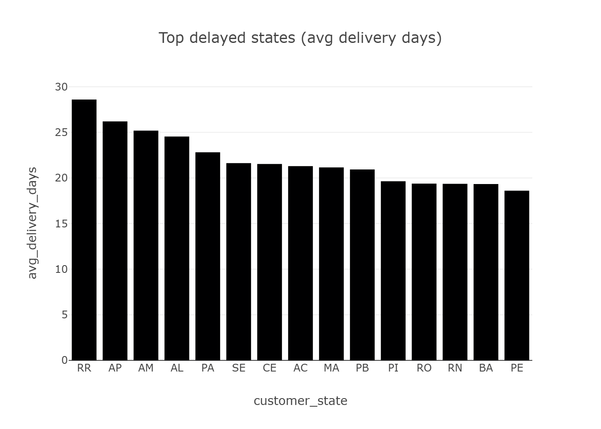
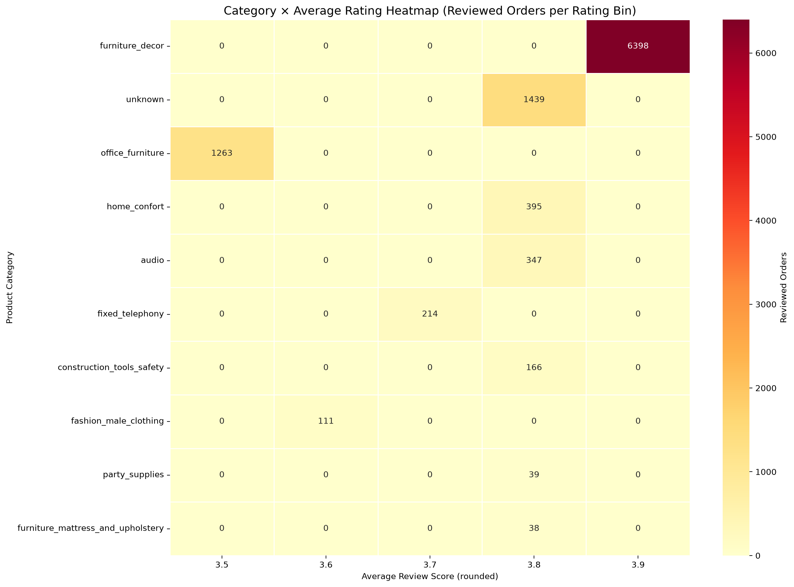
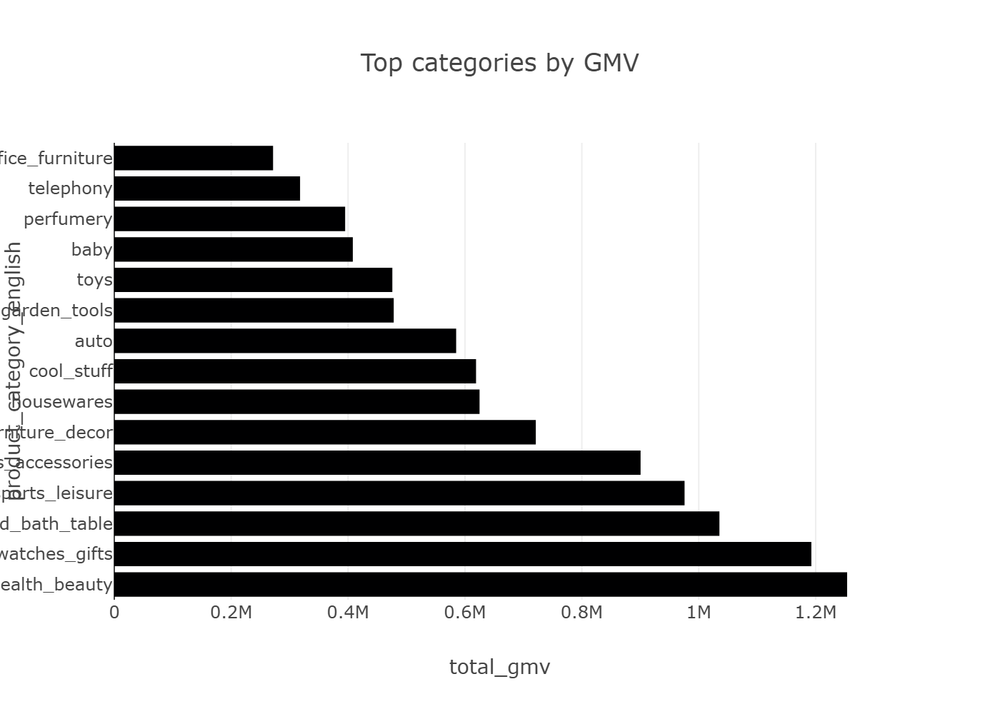
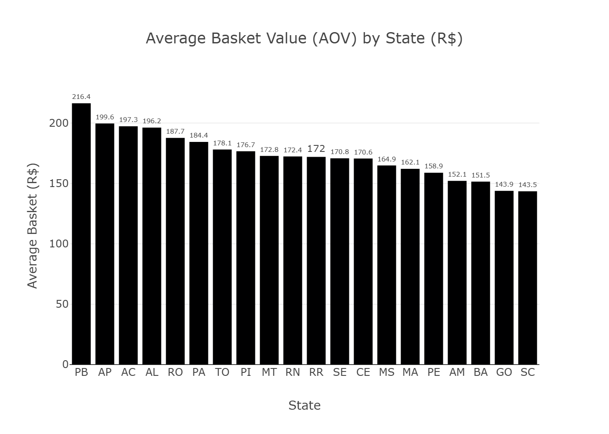
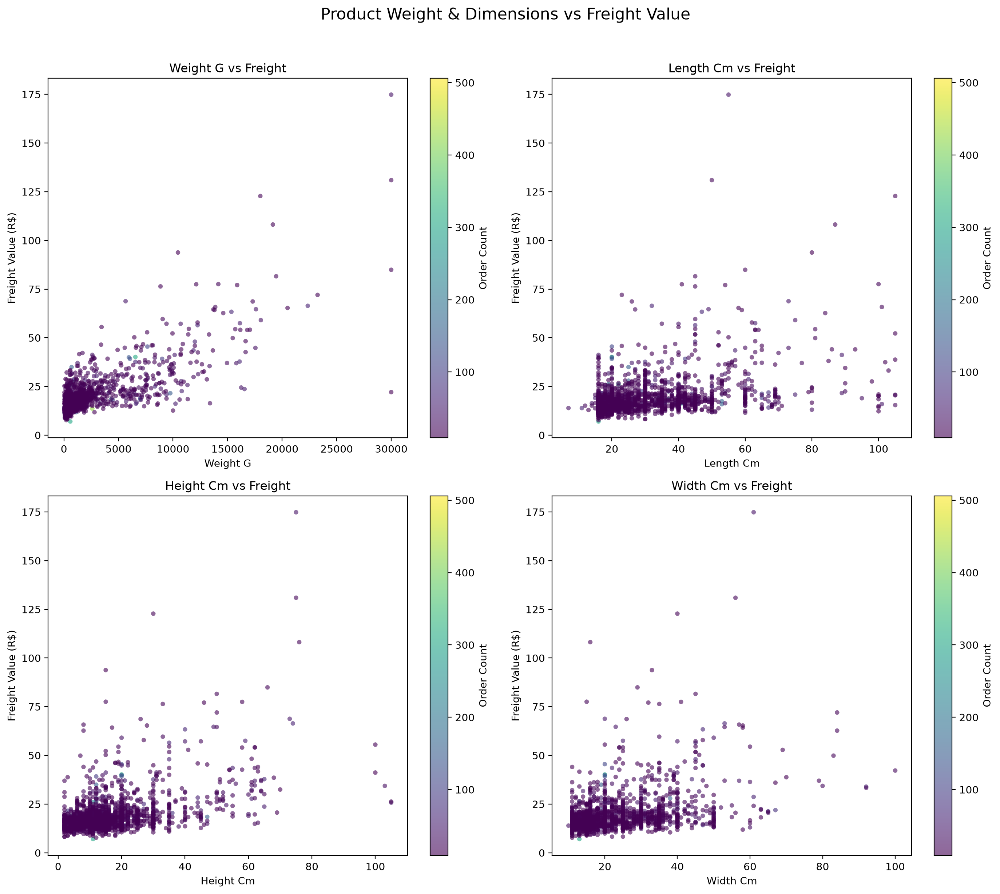

# Agentic BI 多表电商运营分析系统项目报告

作者：2351434 陈鸿良 2352845 刘宗昊 2353408 周由 2353249 马源胜

## 项目背景与动机

随着大语言模型和多智能体框架逐渐成熟，商业智能系统正在从传统的“固定看板”走向“主动分析与决策引擎”。传统 BI 工具通常依赖分析人员提前设计指标、维度和筛选器，业务人员只能在既定页面中查看结果。如果问题已经被设计进仪表板，例如“本月销售额是多少”“各州订单量排名如何”，固定看板可以快速给出答案；但真实运营场景往往并不止于此。业务人员会继续追问“为什么某些州配送更慢”“哪些卖家导致差评”“如果治理高差评卖家，平台评分会提升多少”“是否存在近期异常波动”。这些问题需要系统理解自然语言、自动选择数据源、执行跨表查询、生成图表、解释原因，并进一步形成运营建议。

本项目围绕 Kaggle 公开的 Brazilian E-Commerce Public Dataset by Olist 构建一个 Agentic BI 多表电商运营分析系统。Olist 数据集包含订单、订单明细、客户、卖家、商品、支付、评价、地理坐标和品类翻译等 9 张核心业务表，覆盖 2016 年 9 月至 2018 年 10 月的巴西电商真实交易记录。数据集中既有结构化交易数据，也有评论文本、地理位置和商品重量尺寸等复杂字段，能够完整模拟电商平台在销售、履约、支付、客户体验和卖家治理方面的分析需求。

项目的核心动机有三点。第一，验证多表电商数据如何通过预聚合视图降低 JOIN 成本。Olist 的常见问题通常需要连接 orders、order_items、customers、payments、products、reviews 等多张表，如果每次自然语言问答都实时执行多表 JOIN 和 GROUP BY，Web 端交互会明显变慢。第二，验证 LangGraph 多 Agent 编排如何提升复杂分析链路的可控性。不同问题不应触发相同流程，描述性问题只需要 SQL 与图表，预测问题才需要时间序列模型，评论问题才需要 NLP，策略问题则需要决策 Agent 综合解释。第三，验证自然语言界面是否能将数据结果转化为可执行的经营动作。课程项目不仅要求“查出数据”，还要求能够提供具有决策价值的规范性建议。

因此，本项目不把系统定位为单纯的数据可视化页面，而是定位为一个可对话、可追问、可解释、可行动的电商运营决策助手。系统通过 MySQL 存储原始表和预聚合物化表，通过 LangGraph 编排 SQL Agent、Visualization Agent、Forecast Agent、NLP Agent、What-if Agent、Anomaly Agent 和 Decision Agent，通过 Streamlit 提供双栏交互界面，最终让非技术业务人员用自然语言完成从“发现问题”到“生成建议”的分析闭环。

从课程目标角度看，本项目覆盖了 Agentic BI 的关键能力：自然语言理解、跨表查询、预聚合加速、多智能体协作、预测建模、评论文本分析、可视化生成、异常检测和规范性建议。项目的输出不仅包括可运行代码，也包括架构图、性能对比图、运行截图、答辩 PPT、讲稿、彩排记录和最终提交清单，能够支撑完整的课程验收与答辩展示。

## 系统架构设计图（含 Agent 流程与预聚合视图层）

系统采用四层架构：数据与存储层、预聚合视图层、多智能体分析层、Web 交互层。整体架构图如下，图中同时展示了原始数据入库、预聚合视图刷新、Agent 调度流程以及 Streamlit 前端输出链路。



第一层是数据与存储层。原始 Olist CSV 文件存放在 `data/raw/`，通过 `utils/db_init.py` 加载到 MySQL 数据库。加载过程中会调用 `utils/data_clean.py` 完成清洗，包括时间字段解析、重复主键去除、评论空值填充、商品品类缺失处理、支付金额数值化、地理表按邮编前缀聚合等。数据库使用 MySQL 8.0 与 utf8mb4 字符集，能够支持葡萄牙语评论文本和中英文混合字段。该层的目标是让上层 Agent 面对的是干净、可 JOIN、可索引的数据，而不是直接处理原始 CSV。

第二层是预聚合视图层。系统通过 `utils/refresh_views.py` 构建 6 个核心业务物化表和 2 个地理辅助表。6 个核心表分别是 `mv_monthly_sales`、`mv_state_sales`、`mv_category_sales`、`mv_delivery_perf`、`mv_seller_perf` 和 `mv_payment_dist`，覆盖月度销售、州级销售、品类销售、配送绩效、卖家绩效和支付分布。2 个地理辅助表为 `mv_zip_geo` 和 `mv_state_geo`，用于避免运行时对百万级 geolocation 表进行大规模 JOIN。预聚合层是整个系统性能优化的关键，采用“离线重计算、在线轻查询”的模式，把高频指标提前计算好，Agent 在线回答问题时优先 SELECT 物化表。

第三层是多智能体分析层。系统以 LangGraph `StateGraph` 为编排核心，所有 Agent 共享 `AgenticState` 状态对象。用户问题首先进入 Coordinator Agent，由协调器判断问题意图、生成结构化任务计划、决定是否需要预测、NLP、可视化、What-if 或异常检测。随后 SQL Agent 根据问题生成安全 SELECT 查询，并优先命中预聚合视图。Forecast Agent 基于 `mv_monthly_sales` 执行未来 6 周 GMV 预测；NLP Agent 从评论中抽取关键词、情感极性和主观性；Visualization Agent 根据可用结果生成图表；What-if Agent 模拟高差评卖家治理对评分的影响；Anomaly Agent 扫描订单量骤降、准时率异常等风险；Decision Agent 最后综合所有结果，形成面向运营团队的解释与建议。

第四层是 Web 交互层。Streamlit 仪表板采用左侧对话区、右侧图表区的双栏布局。左侧展示历史问答，支持用户连续追问；右侧展示图表、表格和模型输出。用户既可以使用快速模式获得 1 到 4 张聚焦图表，也可以点击重新生成完整图表集。Dashboard 启动时会调用 `utils.startup_check.ensure_views_ready(auto_refresh=True)`，检查基础表和预聚合视图是否存在，缺失时自动刷新，从而减少现场演示时的环境风险。

这种架构的优势在于边界清晰。数据层负责可信数据，预聚合层负责性能，Agent 层负责智能编排，Web 层负责交互呈现。与简单的“LLM 直接生成 SQL”相比，本系统在 SQL 安全、视图命中、条件路由、上下文记忆、图表资产归档和异常兜底方面都有明确设计，更符合可演示、可维护、可解释的课程项目要求。

## 关键技术选型说明（LLM、Agent框架、查询引擎、预测模型）

本项目的技术选型围绕“真实可运行、课堂可演示、工程可解释”三条原则展开。系统并不追求堆叠复杂模型，而是优先保证自然语言问答、数据查询、图表生成和决策建议的端到端闭环稳定。

在 LLM 方面，项目接入 DeepSeek API 作为主要语言模型能力，用于 Coordinator Agent 的任务分解、SQL Agent 的自然语言到 SQL 转换，以及 Decision Agent 的经营建议生成。选择外部 LLM 的原因是自然语言业务问题存在大量语义歧义，例如“那准时率呢”依赖上一轮上下文，“哪些卖家差评率最高”既涉及卖家绩效表又可能涉及评价表，“如何降低东北部退货率”需要知道 Olist 数据集没有真实退货表并使用低评分作为代理口径。LLM 能够在这些场景中提供更灵活的解释与规划能力。同时，系统对 LLM 输出设置了规则兜底：协调器在 API 不可用或返回非 JSON 时使用关键词规则；SQL Agent 对输出进行只读校验、视图命中校验和内置查询回退；最终回答为空时由 `fallback_answer_from_tables` 基于 DataFrame 直接生成基础答案。这样既利用了 LLM 的语义能力，又避免外部模型不稳定导致系统完全不可用。

在 Agent 框架方面，项目选用 LangGraph。相比线性函数调用，LangGraph 的优势是可以将多个 Agent 节点组织成状态图，并通过 `add_conditional_edges` 实现条件分支。项目中的图从 Coordinator 节点开始，进入 Analysis 节点后根据 `state.route` 决定是否进入 Forecast、NLP、Viz、What-if、Anomaly 和 Decision 节点。描述性问题不触发 SARIMAX，评论问题才触发 NLP，模拟问题才触发 What-if，异常问题才触发 Anomaly。这样可以避免所有问题都执行全量分析，提高响应速度，也便于在报告和答辩中解释“为什么该问题调用了这些 Agent”。

在查询引擎方面，项目选用 MySQL 8.0。课程要求强调多表 JOIN、预聚合视图和性能对比，MySQL 能够清晰展示索引、物化表、SQL 查询和数据库初始化流程。系统通过 SQLAlchemy 建立连接，并在 `utils/refresh_views.py` 中用 `CREATE TABLE ... AS SELECT` 方式生成物化表。对于高频 KPI，SQL Agent 优先查询预聚合表；对于商品重量、尺寸与运费关系、原始评论文本、具体订单明细等视图无法覆盖的问题，才回退基础表。查询安全方面，SQL Agent 只允许 SELECT，拒绝 INSERT、UPDATE、DELETE、DROP、ALTER、CREATE、TRUNCATE 等写操作。

在预测模型方面，项目采用 statsmodels SARIMAX 对月度 GMV 进行未来 6 周预测。Olist 数据的时间跨度约 25 个月，样本不算长，使用复杂深度学习模型并不合适。SARIMAX 对中小规模时间序列更易解释，也能输出置信区间，适合课程项目展示。模型输入来自 `mv_monthly_sales`，避免每次预测前实时 JOIN orders 与 order_items。若历史数据不足，系统可回退到更简单的移动平均逻辑，保证预测节点不会阻塞整个图。

在 NLP 方面，项目结合 TF-IDF 关键词、TextBlob 极性与主观性评分，针对 order_reviews 评论文本提取差评主题、好评/差评词云和情感摘要。由于 Olist 评论多为葡萄牙语，TextBlob 情感评分存在语言适配限制，报告中也明确将其定位为课堂项目中的轻量结构化特征，而不是生产级多语言情感模型。

在可视化方面，项目使用 Plotly、Matplotlib、Seaborn、Folium 和 WordCloud。Plotly 适合交互式趋势和柱状图，Matplotlib/Seaborn 适合报告与 PPT 静态图，Folium 用于地理热力图，WordCloud 用于评论关键词展示。生成的图片统一归档到 `data/artifacts/demo/`，供 Web、报告和 PPT 复用，避免同一张图在多个交付物中口径不一致。

## 预聚合视图设计专节：列出创建的视图及其SQL定义，说明如何被Agent利用；附上至少一组性能对比截图

预聚合视图层是本项目最重要的工程优化。Olist 数据虽然规模不算工业级超大数据，但多表结构复杂，很多业务问题都需要 3 到 5 张表 JOIN。如果用户每次在 Web 界面提问都触发原始表聚合，系统响应会随问题复杂度显著波动，影响课堂演示稳定性。预聚合层将高频指标提前计算成物化表，让 Agent 在线阶段以轻量 SELECT 获取结果。

项目创建的预聚合表如下：

| 视图/物化表 | 粒度 | 核心字段 | 典型问题 |
|---|---|---|---|
| `mv_monthly_sales` | 年-月 | `year_month`, `total_gmv`, `total_orders`, `avg_basket`, `total_freight` | 月度 GMV、销售趋势、预测输入 |
| `mv_state_sales` | 年-月-州 | `year_month`, `customer_state`, `total_gmv`, `total_orders`, `unique_customers` | 各州销售额、区域排名 |
| `mv_category_sales` | 年-月-品类 | `year_month`, `product_category_english`, `total_gmv`, `total_orders`, `avg_price` | 品类销售表现 |
| `mv_delivery_perf` | 年-月-州 | `avg_delivery_days`, `on_time_rate`, `delayed_orders` | 配送时效、准时率、延迟州 |
| `mv_seller_perf` | 年-月-卖家 | `seller_id`, `seller_state`, `total_gmv`, `total_orders`, `avg_review_score` | 卖家绩效、差评卖家 |
| `mv_payment_dist` | 年-月-支付方式 | `payment_type`, `total_transactions`, `avg_installments`, `total_value` | 支付偏好、分期行为 |
| `mv_zip_geo` | 邮编前缀 | `geolocation_zip_code_prefix`, `lat`, `lng` | 地理 JOIN 辅助 |
| `mv_state_geo` | 州 | `customer_state`, `lat`, `lng`, `total_gmv`, `total_orders` | 州级地理图 |

`mv_monthly_sales` 的 SQL 定义如下。它从订单表和订单明细表中聚合月度 GMV、订单量、客单价和运费，是趋势分析与预测模型的基础输入。

```sql
SELECT
  CONCAT(YEAR(o.order_purchase_timestamp), '-', LPAD(MONTH(o.order_purchase_timestamp), 2, '0')) AS year_month,
  SUM(oi.price) AS total_gmv,
  COUNT(DISTINCT o.order_id) AS total_orders,
  (SUM(oi.price) / NULLIF(COUNT(DISTINCT o.order_id), 0)) AS avg_basket,
  SUM(oi.freight_value) AS total_freight
FROM orders o
JOIN order_items oi ON oi.order_id = o.order_id
WHERE o.order_status IN ('delivered', 'shipped', 'invoiced', 'approved')
GROUP BY year_month;
```

`mv_state_sales` 用于回答区域销售问题，将订单、客户和订单明细连接后按月份与客户州聚合。

```sql
SELECT
  CONCAT(YEAR(o.order_purchase_timestamp), '-', LPAD(MONTH(o.order_purchase_timestamp), 2, '0')) AS year_month,
  c.customer_state,
  SUM(oi.price) AS total_gmv,
  COUNT(DISTINCT o.order_id) AS total_orders,
  COUNT(DISTINCT c.customer_unique_id) AS unique_customers
FROM orders o
JOIN customers c ON c.customer_id = o.customer_id
JOIN order_items oi ON oi.order_id = o.order_id
WHERE o.order_status IN ('delivered', 'shipped', 'invoiced', 'approved')
GROUP BY year_month, c.customer_state;
```

`mv_category_sales` 将商品表和品类翻译表接入销售聚合，解决葡萄牙语品类名不便展示的问题。

```sql
SELECT
  CONCAT(YEAR(o.order_purchase_timestamp), '-', LPAD(MONTH(o.order_purchase_timestamp), 2, '0')) AS year_month,
  COALESCE(t.product_category_name_english, p.product_category_name, 'unknown') AS product_category_english,
  SUM(oi.price) AS total_gmv,
  COUNT(DISTINCT o.order_id) AS total_orders,
  AVG(oi.price) AS avg_price
FROM orders o
JOIN order_items oi ON oi.order_id = o.order_id
JOIN products p ON p.product_id = oi.product_id
LEFT JOIN product_category_name_translation t
  ON t.product_category_name = p.product_category_name
WHERE o.order_status IN ('delivered', 'shipped', 'invoiced', 'approved')
GROUP BY year_month, product_category_english;
```

`mv_delivery_perf` 专门服务配送诊断，聚合平均配送天数、准时率和延迟订单数。它是回答“哪些州配送更慢”“准时率是多少”的核心视图。

```sql
SELECT
  CONCAT(YEAR(o.order_purchase_timestamp), '-', LPAD(MONTH(o.order_purchase_timestamp), 2, '0')) AS year_month,
  c.customer_state,
  AVG(DATEDIFF(o.order_delivered_customer_date, o.order_purchase_timestamp)) AS avg_delivery_days,
  AVG(CASE WHEN o.order_delivered_customer_date <= o.order_estimated_delivery_date THEN 1 ELSE 0 END) AS on_time_rate,
  SUM(CASE WHEN o.order_delivered_customer_date > o.order_estimated_delivery_date THEN 1 ELSE 0 END) AS delayed_orders
FROM orders o
JOIN customers c ON c.customer_id = o.customer_id
WHERE o.order_status = 'delivered'
  AND o.order_delivered_customer_date IS NOT NULL
  AND o.order_estimated_delivery_date IS NOT NULL
GROUP BY year_month, c.customer_state;
```

`mv_seller_perf` 将卖家维度和评价维度结合，用于定位低评分卖家和卖家治理优先级。

```sql
SELECT
  CONCAT(YEAR(o.order_purchase_timestamp), '-', LPAD(MONTH(o.order_purchase_timestamp), 2, '0')) AS year_month,
  oi.seller_id,
  s.seller_state,
  SUM(oi.price) AS total_gmv,
  COUNT(DISTINCT o.order_id) AS total_orders,
  AVG(r.review_score) AS avg_review_score
FROM orders o
JOIN order_items oi ON oi.order_id = o.order_id
JOIN sellers s ON s.seller_id = oi.seller_id
LEFT JOIN order_reviews r ON r.order_id = o.order_id
WHERE o.order_status IN ('delivered', 'shipped', 'invoiced', 'approved')
GROUP BY year_month, oi.seller_id, s.seller_state;
```

`mv_payment_dist` 聚合支付方式、交易次数、平均分期数和支付金额，用于支付偏好分析。

```sql
SELECT
  CONCAT(YEAR(o.order_purchase_timestamp), '-', LPAD(MONTH(o.order_purchase_timestamp), 2, '0')) AS year_month,
  p.payment_type,
  COUNT(*) AS total_transactions,
  AVG(p.payment_installments) AS avg_installments,
  SUM(p.payment_value) AS total_value
FROM orders o
JOIN payments p ON p.order_id = o.order_id
WHERE o.order_status IN ('delivered', 'shipped', 'invoiced', 'approved')
GROUP BY year_month, p.payment_type;
```

地理辅助表中，`mv_zip_geo` 先按邮编前缀聚合经纬度，再由 `mv_state_geo` 汇总到州级。这样做的原因是 geolocation 原始表行数接近百万，且同一邮编前缀存在大量重复，若每次绘制地图都实时 JOIN，会产生不必要的性能开销。

Agent 利用预聚合视图的方式体现在三个位置。第一，SQL Agent 的系统 Prompt 明确列出所有视图及字段，并要求“能用预聚合视图回答的 KPI 必须使用视图”。第二，运行时根据问题关键词计算 preferred views，例如问题包含“州、销售额、排名”时优先 `mv_state_sales`，包含“配送、准时、延迟”时优先 `mv_delivery_perf`，包含“支付、分期”时优先 `mv_payment_dist`。第三，若 LLM 声称使用视图但 SQL 未引用视图，或问题明显应命中视图但 LLM 生成了基础表 JOIN，系统会强制改写为内置安全视图查询，并将策略写入 `_question_meta.view_strategy`。

性能对比图如下，来自陈鸿良的性能对比产物 `data/artifacts/perf/perf_compare_chart.png`：



该组测试对比了同一月度 GMV 查询在两种路径下的执行时间：一是原始路径 `orders JOIN order_items GROUP BY year_month`，二是预聚合路径 `SELECT FROM mv_monthly_sales`。A 阶段记录显示，原始 JOIN 聚合平均耗时约 0.896 秒，而预聚合视图查询约 0.001 秒，约 600 倍加速。即便在不同硬件环境下绝对值会变化，预聚合视图显著降低在线查询延迟这一结论仍成立。对 Agentic BI 系统而言，这一点尤其重要，因为自然语言问题可能在一次回答中触发多个查询和图表，任何一个高频聚合查询的延迟都会放大整体等待时间。

## 数据集描述与预处理步骤

项目采用 Olist 巴西电商公开数据集。该数据集由 9 张 CSV 表组成，覆盖订单、订单行、商品、客户、卖家、支付、评价、地理坐标和品类翻译。它的业务结构接近真实电商平台：客户下单后生成订单，订单包含多个商品明细，商品由卖家提供，支付表记录付款方式和分期，订单完成后产生评价，客户与卖家的邮编可连接到地理坐标。正因为数据分散在多个实体中，它非常适合检验多表 JOIN、预聚合和 Agent 自动分析能力。

九张核心表如下：

| 表 | 业务含义 | 关键字段 |
|---|---|---|
| `orders` | 订单主表 | `order_id`, `customer_id`, `order_status`, 购买/发货/送达/预计送达时间 |
| `order_items` | 订单明细 | `order_id`, `product_id`, `seller_id`, `price`, `freight_value` |
| `products` | 商品属性 | `product_id`, `product_category_name`, 重量、长宽高 |
| `customers` | 客户信息 | `customer_id`, `customer_unique_id`, `customer_state`, 邮编 |
| `sellers` | 卖家信息 | `seller_id`, `seller_state`, 邮编 |
| `payments` | 支付信息 | `payment_type`, `payment_installments`, `payment_value` |
| `order_reviews` | 评价信息 | `review_score`, `review_comment_title`, `review_comment_message` |
| `geolocation` | 地理坐标 | 邮编前缀、经纬度、城市、州 |
| `product_category_name_translation` | 品类翻译 | 葡语品类名、英文品类名 |

数据预处理由 `utils/data_clean.py` 和 `utils/db_init.py` 完成。处理流程首先检查 `data/raw/` 下 9 个 CSV 是否齐全，然后逐表读取并调用清洗函数，最后写入 MySQL 并创建关键索引。该流程可通过如下命令执行：

```bash
python -m utils.db_init
```

订单表 `orders` 的清洗重点是时间字段标准化。系统解析 `order_purchase_timestamp`、`order_approved_at`、`order_delivered_carrier_date`、`order_delivered_customer_date`、`order_estimated_delivery_date` 等字段，并去除重复 `order_id`。这一步对配送时效分析非常关键，因为平均配送天数和准时率均依赖购买时间、实际送达时间和预计送达时间。

订单明细表 `order_items` 的清洗重点是价格、运费和发货截止时间。系统去除 `(order_id, order_item_id)` 重复记录，将 `price` 与 `freight_value` 转换为数值，并解析 `shipping_limit_date`。这些字段既服务 GMV 与客单价计算，也服务商品重量/尺寸与运费关系分析。

商品表 `products` 的清洗重点是品类与商品属性。系统将缺失的 `product_category_name` 填充为 `unknown`，并将重量、长度、高度、宽度等字段转为数值。C 阶段的扩展散点图正是基于这些属性，分析商品重量、尺寸和运费之间的关系。

客户表和卖家表的清洗重点是地理字段。系统统一州缩写格式，处理邮编前缀类型，去除主键重复。后续 `mv_state_sales`、`mv_delivery_perf` 和 `mv_seller_perf` 都需要客户州或卖家州作为分组维度，因此这些字段必须稳定。

支付表 `payments` 的清洗重点是支付金额和分期数。系统将 `payment_value` 和 `payment_installments` 数值化，并统一 `payment_type` 格式。支付分析不仅用于回答“哪种支付方式最受欢迎”，也用于解释信用卡分期在高客单价商品中的经营价值。

评价表 `order_reviews` 的清洗重点是评分有效性和文本空值。系统将 `review_score` 限制在 1 到 5 的有效区间，评论标题和评论正文空值填充为空字符串，并保证每个订单只保留一条主要评价。NLP Agent 后续会从评论文本中提取差评关键词、好评词云和情感特征。

地理表 `geolocation` 的清洗是性能优化的重要步骤。原始地理表存在大量同一邮编前缀的重复记录，如果直接 JOIN customers 或 sellers，会产生膨胀的中间结果。系统按 `geolocation_zip_code_prefix` 聚合，对经纬度取均值，对城市和州保留代表值，从而将百万级数据压缩为可用于地图绘制的辅助表。这一处理与预聚合层中的 `mv_zip_geo`、`mv_state_geo` 形成配合。

品类翻译表用于将葡萄牙语商品品类名转换为英文名。清洗时系统去除重复映射，并在英文名缺失时回退到原葡语名，避免品类聚合中出现空值。这样报告、PPT 和图表中的品类名称更易读，也便于与业务建议对应。

总体而言，预处理遵循“加载即清洗，清洗即可分析”的原则。它不是孤立的数据准备步骤，而是后续预聚合视图、SQL Agent、Visualization Agent、NLP Agent 和 Decision Agent 的共同基础。

## 智能体实现和多智能体调度方法

系统的智能体实现围绕共享状态 `AgenticState` 展开。状态对象保存用户问题、对话历史、结构化计划、路由信息、查询表格、图表路径、预测结果、NLP 结果、What-if 结果、异常检测结果和最终回答。所有节点读写同一个状态对象，避免在 Agent 之间传递零散变量。

Coordinator Agent 是入口节点，负责理解用户问题并生成执行计划。它采用“LLM 优先、规则兜底”的策略。正常情况下，LLM 返回包含 intent、subtasks、route 和 context_rewrite 的 JSON。例如诊断型问题会生成 SQL、NLP、Decision 等子任务；预测型问题会设置 `forecast=true`；评论型问题会设置 `nlp=true`；模拟问题会设置 `whatif=true`。如果 LLM 不可用，协调器会根据关键词触发规则路由，确保系统仍能运行。

SQL Agent 负责将自然语言问题转为安全 SELECT 查询。它的 Prompt 明确要求只输出 JSON，不允许任何写操作，并优先使用预聚合视图。SQL Agent 输出 `use_view`、`view_name`、`sql` 和 `kpi_explanation`。运行时会调用 `_is_safe_select` 拒绝非 SELECT 语句，并通过 preferred views 机制校验视图命中情况。若问题包含“2017 年哪个州销售额最高”，系统会优先选择 `mv_state_sales`；若问题包含“准时率”“延迟”，优先 `mv_delivery_perf`；若问题包含“支付方式”“分期”，优先 `mv_payment_dist`。

Analysis 节点不仅执行动态 SQL，还会根据问题加载轻量预聚合表。在 quick mode 下，它只加载与问题相关的视图，避免每次都读取完整数据集；在完整模式下，它加载月度销售、州级销售、品类销售、配送绩效、卖家绩效、支付分布和地理表，供可视化 Agent 生成完整图表集。对于商品重量与运费关系、差评品类、配送全国均值对比等诊断问题，Analysis 节点会执行专门 SQL 形成 `scatter_weight_freight`、`diagnostic_delivery_vs_national`、`diagnostic_bad_review_sellers`、`diagnostic_bad_review_categories` 等表。

Forecast Agent 基于 `mv_monthly_sales` 进行未来 6 周 GMV 预测。它只在 route 中 `forecast=true` 时触发，避免非预测问题调用 SARIMAX。预测结果会保存为结构化表，既可供可视化 Agent 绘制趋势图，也可供 Decision Agent 解释趋势。

NLP Agent 只在评论、差评、原因、情感等问题中触发。它从 order_reviews 评论文本中提取负面关键词、正面关键词、情感极性和主观性，并将结果写入 state.nlp。Visualization Agent 可进一步基于这些词项生成好评/差评词云，Decision Agent 则用它解释低评分品类和卖家治理原因。

Visualization Agent 根据当前 state 中可用表和用户问题选择图表。它支持月度 GMV 趋势、州级 GMV 柱状图、各州客单价、品类 Top、配送天数、支付方式与分期热力图、品类评分热力图、重量/尺寸与运费散点图、地理热力图和评论词云等。生成结果保存到 `data/artifacts/demo/`，便于报告和 PPT 复用。

What-if Agent 作为加分功能，用于回答“如果将 Top 20 高差评卖家的商品统一下架，平台整体评分预估提升多少”这类问题。它从卖家绩效和评价数据中筛选低评分卖家，估算移除这些卖家订单后的平台平均评分变化，并同时提示潜在 GMV 损失，避免给出过度简单的“直接下架”建议。

Anomaly Agent 用于扫描近期州级订单量骤降、准时率异常或差评率突升。它将异常输出为风险等级和建议动作，体现系统从被动回答走向主动预警的能力。

Decision Agent 是最终汇总节点。它接收 SQL 查询摘要、预测结果、NLP 结果、What-if 结果和异常检测结果，生成面向业务团队的解释与行动建议。若 LLM 没有返回文本，系统会基于已有表格生成 fallback 回答，例如直接指出某州准时率、Top 差评卖家或查询结果前五行。

多轮对话方面，系统使用 LangGraph MemorySaver 和显式 conversation_history 两层机制。Web 端和 CLI 调用图时都传入稳定 thread_id，使同一会话具备状态记忆；同时前端把最近问答注入 state，协调器可将“那准时率呢”改写为包含上轮问题背景的完整查询。这使系统更符合真实业务交流方式，而不是只能回答孤立问题。

## 运行结果截图、分析解释及决策建议解读

系统运行结果覆盖描述性分析、诊断性分析、预测性分析、规范性建议和加分能力。本节继续使用周由与马源胜共同整理、筛选和复核的演示素材，图片均来自 `data/artifacts/demo/`。

首先是州级 GMV 分布。系统在回答“2017 年哪个州销售额最高”或“各州销售额排名如何”时，会优先查询 `mv_state_sales` 并生成州级 GMV 柱状图。



结果显示，SP、RJ、MG 等州是 Olist 平台的核心销售市场，其中 SP 州贡献最高。这一发现符合巴西电商市场的区域集中性，也说明平台在东南部拥有更成熟的客户与物流基础。业务建议是：对 SP 等成熟市场保持稳定供给和精细化运营，对 RJ、MG 等高价值市场进一步做品类渗透，对销售规模较小但客单价较高的州尝试定向营销。

第二是支付方式与分期行为。系统通过 `mv_payment_dist` 生成支付方式与分期数热力图。



热力图显示信用卡是最主要的支付入口，且分期行为在巴西电商场景中非常重要。Boleto 仍占有一定比例，说明线下支付习惯仍需被保留。从经营角度看，平台可以围绕高客单价品类设计 3 期或 6 期免息活动，在商品页突出分期信息，以降低用户一次性支付压力。同时，不应简单取消 boleto，因为它覆盖了部分不偏好信用卡的用户群体。

第三是配送诊断。系统在回答“为什么某些州平均配送时长高于全国均值”时，会查询 `mv_delivery_perf` 和 `diagnostic_delivery_vs_national`，并生成配送天数图。



配送诊断的核心不只是找出“哪里慢”，而是把延迟问题转化为可执行动作。结果显示北部和东北部部分州平均配送天数更长、准时率更低，可能与仓储集中、运输距离、末端物流基础设施有关。建议包括：在 Recife 或 Fortaleza 等区域设置中转仓，引入本地第三方物流商，对高延迟州提供加急配送选项，并鼓励本地卖家入驻，实现区域内发货。

第四是品类评分热力图。系统通过评价表、商品表和品类翻译表构造品类与评分矩阵，用于定位服务质量风险。



该图帮助业务方识别哪些品类更容易集中在低评分区间。低评分品类需要优先检查商品描述、物流破损、售后响应和退款流程；高评分品类则可以作为复购推荐和供给扩张的重点。对 furniture_decor 等易受运输损坏影响的品类，平台可以引入包装认证；对 fashion_bags_accessories 等容易出现实物与描述不符的品类，可以增加图片审核和尺码说明。

第五是品类销售与客单价分析。系统能够生成 Top 品类销售柱状图与各州客单价柱状图。





品类销售图用于判断供给结构和头部类目，客单价图用于识别区域价值差异。一个州的 GMV 高不一定代表客单价最高，因此平台可以把州级销售规模和客单价结合起来制定策略：高 GMV 州适合做稳定供给和履约效率优化，高客单价州适合推广高价值品类和分期营销。

第六是商品重量、尺寸与运费关系。系统在视图无法覆盖商品物理属性时回退基础表，连接 `order_items`、`orders`、`products` 和品类翻译表，生成散点图。



散点图用于发现物流成本中的离群点和聚类。一般来说，商品越重、体积越大，运费越高；但图中也可能出现重量不高但运费异常高的点，提示包装体积、跨州配送或品类特殊性带来的额外成本。业务建议是对异常运费订单进行抽样复核，优化运费模板，并对高体积低价值商品设置更明确的物流成本提示。

第七是地理热力图。C 阶段使用 Folium 生成巴西州级地理可视化，素材保存为 HTML。


由于 Markdown 到 PDF 的转换环境不一定能直接嵌入 HTML 地图，报告中以州级 GMV 图作为静态展示，同时保留 `data/artifacts/demo/folium_geo_heatmap.html` 作为可交互地图交付物。该地图可以在浏览器中查看州级销售和地理分布，辅助解释区域市场差异。

综合以上结果，系统形成的经营建议可以归纳为五类。第一，物流侧优先改善北部和东北部高延迟州，通过中转仓、本地物流和加急配送提升准时率。第二，卖家侧对低评分且订单量不低的卖家设置 90 天整改期，持续低于阈值则降低曝光或下架。第三，品类侧对高差评品类实施商品描述审核、包装标准和售后 SLA。第四，支付侧围绕信用卡和分期设计高客单价转化活动，同时保留 boleto。第五，数据侧上线异常检测，持续扫描州级订单骤降、准时率突降和差评率突升，缩短问题发现周期。

## 技术挑战与解决方案

项目实施过程中遇到的第一个挑战是多表 JOIN 成本。Olist 的高频问题往往需要跨订单、订单明细、客户、支付和评价多表聚合。若每次用户提问都实时计算，Web 响应速度不稳定。解决方案是建立 6 个核心预聚合物化表和 2 个地理辅助表，并让 SQL Agent 优先命中视图。性能对比证明，月度 GMV 查询在预聚合路径下显著快于原始 JOIN。

第二个挑战是 geolocation 表膨胀。原始地理表包含大量重复邮编前缀，直接 JOIN 会导致中间结果快速放大，影响地图绘制和地理统计。解决方案是在数据清洗阶段按邮编前缀聚合经纬度，并在预聚合阶段生成 `mv_zip_geo` 和 `mv_state_geo`。这样地图相关问题可以直接读取州级或邮编级辅助表，避免运行时大 JOIN。

第三个挑战是自然语言追问的上下文丢失。业务用户不会每次都完整描述问题，而会说“那准时率呢”“再细化一下”“东北部呢”。解决方案是同时使用 LangGraph MemorySaver 和显式 conversation_history。MemorySaver 保存同一 thread_id 下的图状态，conversation_history 直接注入协调器和 SQL Agent。协调器在识别追问后生成 context_rewrite，把当前问题改写成带上轮背景的完整分析任务。

第四个挑战是不同问题不应触发全部 Agent。最初的线性流程会让描述性问题也执行预测和 NLP，造成不必要等待。解决方案是通过 LangGraph 条件路由控制节点调用。描述性问题走 SQL、Viz、Decision；预测问题增加 Forecast；评论问题增加 NLP；What-if 和异常问题按需触发对应加分 Agent。这样既提高效率，也让答辩中可以清晰解释系统“按问题类型选择最小必要路径”。

第五个挑战是 LLM 输出不稳定。LLM 可能返回非 JSON、生成基础表 JOIN、遗漏视图或输出空回答。解决方案包括：协调器规则兜底、SQL 只读校验、preferred views 强制改写、查询结果 fallback 回答，以及 Decision Agent 异常捕获。系统并不盲目信任 LLM，而是把 LLM 放在受约束的工程框架内使用。

第六个挑战是 Olist 数据集中没有真实退货表，但商案附录中包含“如何降低高退货率”问题。解决方案是在系统回答和报告中明确口径：使用 `review_score <= 2` 作为强不满意或高退货风险代理指标。这个代理不能等同于真实退货率，但可以在缺少退货字段时为运营改进提供近似信号。

第七个挑战是评论文本为葡萄牙语。TextBlob 对葡萄牙语情感极性的准确度不如英语模型。项目解决方式是将 TextBlob 定位为轻量加分特征，同时结合 TF-IDF 关键词和词云展示，不把单一情感分数作为唯一决策依据。后续若进入生产环境，应引入葡萄牙语专用情感模型或多语言 Transformer。

第八个挑战是报告、PPT 和 Web 演示需要口径一致。解决方案是把所有图表素材统一归档到 `data/artifacts/demo/` 和 `data/artifacts/perf/`，报告和 PPT 引用同一批图片，不在不同交付物中重复手工绘制口径不一致的图。马源胜在最终集成阶段补充了演示资产筛选、PPT 页面备注、端到端彩排记录和备用视频整理，并参与检查图表路径、运行结果截图与报告引用是否一致，降低答辩现场环境风险。

## 小组分工和比例

本项目采用四阶段顺序执行，尽量减少并行冲突和交叉依赖。每位成员负责一个相对独立但能向下游交接的模块域，同时在最终集成阶段保留少量交叉协作，确保报告、PPT、Demo 与实际系统功能一致。贡献比例均为 25%。

| 成员 | 主要职责 | 代表性交付物 | 贡献比例 |
|---|---|---|---:|
| 陈鸿良 | 数据清洗、数据库初始化、预聚合刷新、启动自检、性能对比、数据与视图文档 | `utils/data_clean.py`, `utils/db_init.py`, `utils/refresh_views.py`, `utils/startup_check.py`, `data/artifacts/perf/`, `docs/01_data.md`, `docs/02_views.md` | 25% |
| 刘宗昊 | MemorySaver、多轮上下文、协调器任务分解、条件路由主体、诊断 SQL、SQL Agent 视图策略 | `agents/graph.py`, `agents/coordinator.py`, `agents/sql_agent.py`, `config/diagnostic_queries.sql`, `docs/03_agents.md` | 25% |
| 周由 | 可视化补齐、NLP 情感分析、What-if 模拟、异常检测主体、附录问题测试、结果解读 | `agents/viz_agent.py`, `models/nlp_insights.py`, `models/whatif.py`, `agents/anomaly_agent.py`, `docs/04_qa_test.md`, `docs/05_results.md`, `data/artifacts/demo/` | 25% |
| 马源胜 | 架构图与报告整合、答辩 PPT 与讲稿、README、端到端彩排；同时参与多 Agent 演示链路联调、图表资产筛选、Demo 问题脚本化、PPT 备注与运行素材一致性校验 | `docs/architecture.png`, `docs/项目报告.md`, `projects/agentic_bi_olist_defense_ppt169_20260613/`, `答辩PPT.pptx`, `答辩讲稿.txt`, `README.md`, `data/artifacts/rehearsal/`, `提交清单.txt` | 25% |


从结果看，四个阶段形成了清晰的交接链路：陈鸿良输出干净数据库、预聚合视图和性能截图；刘宗昊输出可记忆、可路由、可诊断的 Agent 系统；周由输出可视化、NLP、What-if、异常检测和验证问题覆盖；马源胜在最终阶段完成架构图、报告、PPT、讲稿、README 和提交包，并补充 Demo 链路联调、图表资产复核和答辩材料工程化生成。最终项目不仅满足代码实现要求，也形成了完整的课程交付闭环。
